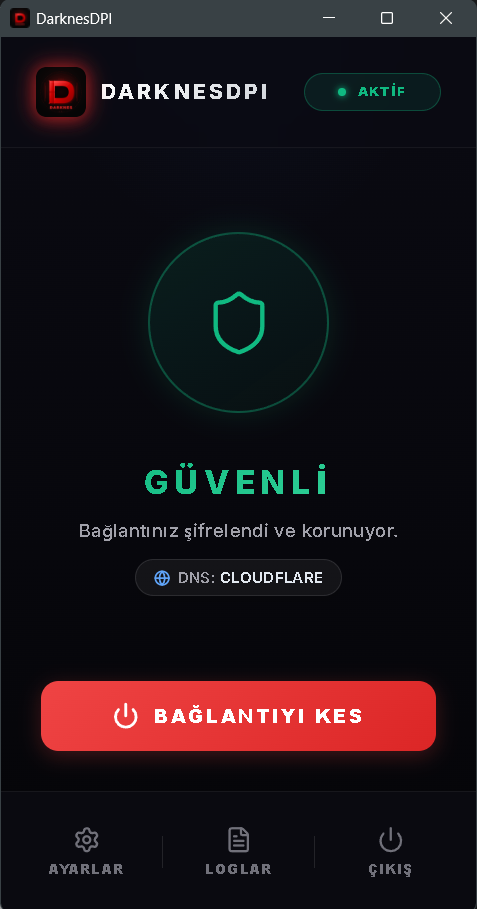
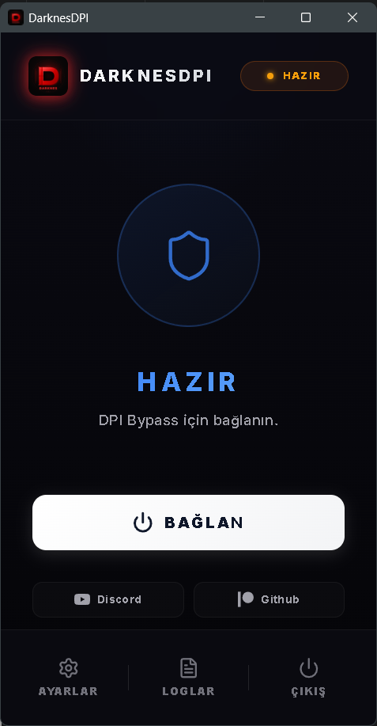

  

<h1 align="center">DarknesDPI</h1>

  <b>Discord ve internet erişim engellerini aşmak için tasarlanmış; çökmeye karşı dayanıklı, modern ve çok yönlü Yerel Proxy & DPI Bypass aracı.</b>

---

## 📸 Ekran Görüntüleri

  
  

---

## 📋 İçindekiler

- [Neden DarknesDPI?](#-neden-darknesdpi)
- [Özellikler](#-özellikler)
- [3 Kademeli DPI Bypass Motoru](#-3-kademeli-dpi-bypass-motoru)
- [Güvenlik](#-güvenlik)
- [Sistem Gereksinimleri](#-sistem-gereksinimleri)
- [Kurulum](#-kurulum)
- [Geliştirici](#-geliştirici)
- [Gizlilik](#-gizlilik)

---

## 💡 Neden DarknesDPI?

Piyasadaki diğer CMD/Java tabanlı araçların (GoodbyeDPI, GreenTunnel vb.) en büyük sorunu; **BSOD veya ani kapanma durumlarında sistem proxy ayarlarını havada bırakarak interneti kesmesidir.**

DarknesDPI, baştan aşağı **Rust (Tauri v2)** altyapısıyla kodlanmış olup **Sentinel Recovery**, **Zombi Process Temizleme** ve **Kurumsal Proxy Yedekleme** (Backup & Restore) sistemleriyle donatılmıştır. Bağlantı ne şekilde koparsa kopsun, internet ayarlarınız otomatik olarak eski haline döner.

---

## ✨ Özellikler

- **Sistem Geneli Akıllı Proxy** — Windows proxy ayarlarını otomatik yönetir; Discord, Roblox, tarayıcılar ve diğer tüm uygulamalar engeli aşar.

<table>
  <tr>
    <td width="35%" align="center">
      
    </td>
    <td width="55%" valign="middle">
      <b>📱 LAN Paylaşımı — Tüm Ev/Ağa Dağıtım</b>  
      Dahili PAC sunucusu sayesinde aynı ağdaki telefon, tablet veya konsol cihazlarınızı engelsiz ağa bağlayabilirsiniz.  
      <i>Wi-Fi Ayarları → Proxy → Otomatik URL kısmına QR kodu okutarak anında bağlanın.</i>
    </td>
  </tr>
</table>

- **DoH (DNS over HTTPS)** — ISP'lerin Port 53 DNS sorgularını izlemesini önlemek için Cloudflare, Google, AdGuard, Quad9 ve OpenDNS üzerinden şifreli DNS.
- **Canlı Soft-Restart** — DNS veya ayar değişikliklerinde uygulamayı yeniden başlatmanıza gerek yoktur; bağlantı otomatik olarak yeni ayarlara geçiş yapar.
- **Modern Arayüz** — Windows 11 uyumlu React/Vite arayüzü, canlı log monitörü ve Türkçe/İngilizce dil desteği.
- **Sistem Tepsisi** — Tek instance mimarisiyle arka planda sessizce çalışır.

---

## ⚙️ 3 Kademeli DPI Bypass Motoru

| Mod | İsim | Açıklama |
| :---: | :--- | :--- |
| **0** | **Turbo** | Sadece SNI ayrıştırması. En düşük gecikme, hafif DPI için. |
| **1** | **Dengeli** | TLS paketlerini Chunk Split yöntemiyle böler. Çoğu ISP'de çalışır. |
| **2** | **Güçlü** | Paket parçalama + sıra bozma (Disorder). En katı engellerde tercih edilir. |

> Gelişmiş ayarlardan 4 / 8 / 16 baytlık Chunk Size ince ayarı yapılabilir.

---

## 🛡️ Güvenlik

1. **Sentinel Recovery** — Ani kapanma/BSOD durumunda uygulama, bir sonraki açılışta proxy kirliliğini tespit ederek otomatik temizler.
2. **Proxy Backup & Restore** — Kurumsal/şirket proxy ayarları varsa, DarknesDPI bunları kapatılırken otomatik geri yükler.
3. **Rust Native WinAPI** — Registry ve yönetici işlemleri, CMD/PowerShell yerine Rust'ın native WinAPI entegrasyonuyla yürütülür.
4. **Thread-Rate Limitli PAC Sunucusu** — Aynı ağdaki yabancı cihazların PAC portuna aşırı bağlantı açmasını önleyen asenkron bağlantı limiti.
5. **Strict CSP + Tauri İzolasyonu** — Arayüzden gelebilecek zararlı kod ihtimalleri sıkı CSP politikası ve Tauri'nin izole shell yetkisiyle engellenir.

---

## 💻 Sistem Gereksinimleri

| Gereksinim | Detay |
| :--- | :--- |
| İşletim Sistemi | Windows 10 / Windows 11 |
| Mimari | x64 |
| RAM | ~60 MB (WebView2 dahil) |
| Yetki | Yönetici (Administrator) |

---

## 🔧 Kurulum

1. **İndirin** — [Releases sayfasından](https://github.com/shencim/DarknesDPI/releases) en güncel `.exe` veya `.msi` dosyasını indirin.
2. **Kurun** — Kurulum sihirbazını çalıştırın. Ek sürücü veya program gerekmez.
3. **Başlatın** — Uygulamayı **yönetici olarak** çalıştırın, istediğiniz modu seçin ve **BAĞLAN** tuşuna basın.

---

## 🤝 Geliştirici

**Shencim** — Crafted with Rust & React

- **Discord:** [discord.gg/darknes](https://discord.gg/darknes)
- **GitHub:** [github.com/shencim](https://github.com/shencim)

---

## 🔒 Gizlilik

> [!IMPORTANT]
> DarknesDPI **hiçbir telemetri veya veri toplama yapısı barındırmaz.**
> IP adresiniz, ziyaret ettiğiniz siteler ve sistem bilgileriniz hiçbir sunucuya gönderilmez. Uygulama logları yalnızca RAM'de tutulur ve program kapandığında silinir.

---

## ⚖️ Sorumluluk Reddi

- DarknesDPI yalnızca yerel makinenizde HTTPS trafiğinin TLS paketlerini (SNI katmanı) böler (Packet Fragmentation). Uzak bir VPN sunucusuyla veri alışverişi yapmaz.
- Yazılım kişisel kullanıma açık ve ücretsizdir. Ticari, yasadışı veya manipülatif amaçlı kullanılamaz. Kullanımdan doğacak tüm teknik ve yasal sorumluluk kullanıcıya aittir.

 

  <strong>DarknesDPI ile kesintisiz ve özgür internete hoş geldiniz.</strong>

---

## 🔍 Bağımsız Güvenlik İncelemesi

> Geliştirme süreci tamamlandıktan sonra proje, **Claude Code (Anthropic)** tarafından bağımsız bir güvenlik incelemesine tabi tutulmuştur. Aşağıdaki bulgular bu inceleme kapsamında raporlanmıştır.

### Güvenlik

- **Tauri v2 İzolasyonu** — WebView ile Rust backend arasındaki her komut `capabilities/default.json` üzerinden beyaz listeyle kısıtlanıyor. Arayüzden rastgele sistem komutu çalıştırılamaz.
- **Strict CSP** — Dış bağlantılar yalnızca `ipc:`, `http://ipc.localhost` ve `https://api.github.com` ile sınırlandırılmış. XSS üzerinden veri sızdırma yolu kapalı.
- **DOMPurify** — Proxy engine log çıktıları arayüze aktarılmadan önce sanitize ediliyor. Log injection vektörü engellendi.
- **PAC Sunucusu Rate Limiting** — Yerel ağdan gelen bağlantılar `MAX_PAC_CONNECTIONS = 50` ile sınırlandırılmış. Yerel ağ kaynaklı DoS girişimlerine karşı korumalı.
- **Native WinAPI Registry Erişimi** — Proxy ayarları PowerShell/CMD yerine doğrudan WinAPI üzerinden yönetiliyor. Komut enjeksiyonu yüzeyi sıfır.
- **DNS IP Whitelist** — `check_dns_latency` komutu yalnızca önceden tanımlanmış 5 DNS sunucusuna ping atılmasına izin veriyor. Ağ keşif (reconnaissance) saldırısı engellendi.
- **Sıfır Telemetri** — Kaynak kodda dışarıya veri gönderen hiçbir yapı tespit edilmedi. Loglar yalnızca RAM'de tutuluyor.

### Güvenilirlik

- **Sentinel Recovery** — Ani kapanma veya BSOD sonrasında bir sonraki açılışta kirli proxy durumu otomatik tespit edilerek temizleniyor.
- **Zombie Process Cleanup** — Önceki oturumdan kalan `darknes-proxy.exe` süreçleri PID dosyasından takip edilerek sonlandırılıyor.
- **Kurumsal Proxy Yedekleme** — Bağlantı kurulmadan önce mevcut sistem proxy ayarları yedekleniyor, uygulama kapanırken geri yükleniyor.

### Sonuç

DarknesDPI, kategorisindeki araçlar arasında güvenlik mimarisi en olgun olanlardan biri. Registry ve sistem işlemlerinin native Rust ile yönetilmesi, izole Tauri shell mimarisi ve çoklu kurtarma mekanizmaları ile günlük kullanım için güvenilir bir araç olarak değerlendirilmiştir.
